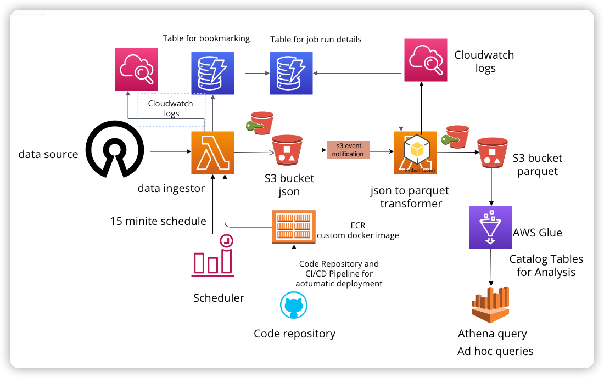

1. **Git Archive** - データソース
2. **ghactivity-ingestor** - １５分ごとにデータソースからデータ収集する
3. **JSON Files** - 処理されたjson内容をS3バゲットに保存
4. **Amazon CloudWatch Logs** - lambdaで処理された内容をログモニタリング
5. **Tables for Bookmarking/Checkpoint and Job Run Details** - ジョブの実行と詳細情報テーブル
6. **GHActivity JSON** -
7. **S3 Event Notification** - S3バゲットにエベントが発生されたら通知処理を行う
8. **ghactivity-transformer** - JSONファイルS３バゲットに保存されたらparquetファイルのETL処理を行う(lambda)
9. **Catalog Tables for Analysis and Ad hoc Queries** - AWS Glue ETL処理
10. **CI/CD Pipeline** - デプロイメント
11. **Custom Docker Image** - docker container
12. **Scheduler** - スケジュール管理 15分ごとにデータソースからデータを収集
13. **Code Repository** - GitHub

